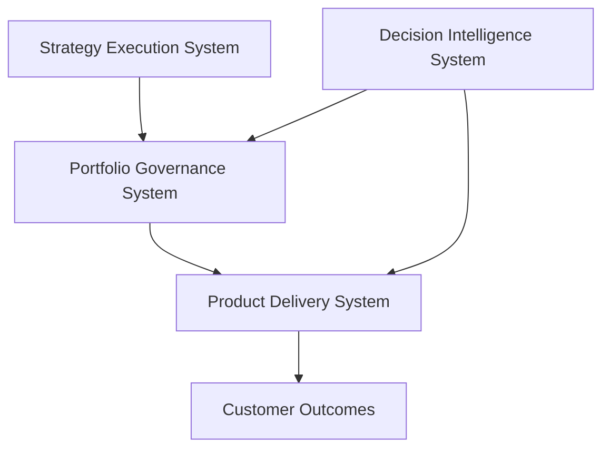
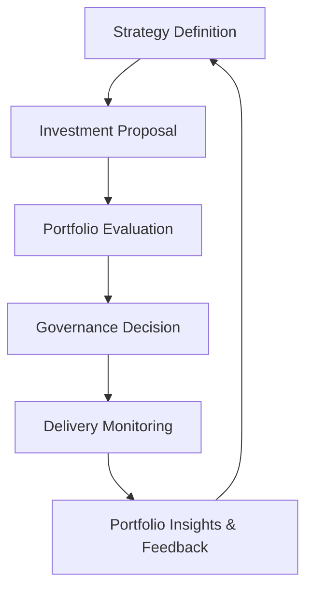

# Portfolio Governance System (Flagship)


Executive operating system for governing product and technology investments through prioritization, capital allocation, delivery risk evaluation, and portfolio visibility.

The Portfolio Governance System provides the structured decision framework used by leadership teams to determine **what initiatives receive investment, how resources are allocated, and how delivery risk is managed across the product portfolio**.

---

## 10-Second Overview

What this repository represents:

A complete governance operating system for managing product and technology investments at scale.

What problem it solves:

Many organizations struggle with fragmented prioritization, inconsistent funding decisions, weak portfolio visibility, and poor institutional memory of past investment decisions.

This system establishes a repeatable executive mechanism to:

- translate strategy into portfolio investments  
- evaluate initiatives using consistent scoring models  
- allocate capital and resources intentionally  
- evaluate delivery risk across the portfolio  
- maintain institutional memory through decision artifacts  

The result is a portfolio governance model that improves **investment alignment, delivery predictability, and executive decision clarity**.

---

## Role in the Product Leadership Systems Architecture



Within the Product Leadership Systems Architecture, the Portfolio Governance System acts as the **decision layer between strategy and execution**.

It translates strategic initiatives into funded investments and provides the governance structure used to manage those investments throughout their lifecycle.

---

## Operating Model

The Portfolio Governance System defines how product organizations govern investments across multiple initiatives and teams.

Key operating responsibilities include:

- translating strategic initiatives into investment candidates  
- prioritizing initiatives using structured scoring frameworks  
- allocating capital and delivery capacity across initiatives  
- evaluating delivery risk across the portfolio  
- maintaining executive decision artifacts and portfolio history  

The operating model ensures that portfolio decisions are **consistent, transparent, and traceable**.

---

## Governance Lifecycle

The Portfolio Governance System manages the lifecycle through which strategic initiatives are proposed, evaluated, funded, and monitored.  

This lifecycle ensures that investments remain aligned with enterprise strategy while maintaining continuous oversight of delivery progress and execution risk.



---

## Core Components

The Portfolio Governance System is composed of several interacting components that support investment evaluation, portfolio prioritization, and delivery oversight.

Key components include:

- **Portfolio Evaluation Frameworks** — scoring models, tiering approaches, and risk evaluation methods used to compare investment opportunities.
- **Governance Operating Model** — decision authorities, stage-gate governance processes, and operating cadence that guide portfolio oversight.
- **Governance Artifacts** — reusable templates used during investment reviews and decision making, such as the [Investment Memo Template](templates/investment-memo-template.md) and [Decision Log](templates/decision-log.md).
- **Portfolio Visualizations** — decision-support tools used during portfolio reviews, including the [Portfolio Heatmap Visualization](visualizations/portfolio-heatmap.md) and the [Delivery Predictability Dashboard](visualizations/delivery-predictability-dashboard.md).

Together these components form the governance layer connecting strategy definition with product delivery execution.

---

## Governance Cadence

Portfolio governance typically operates on a structured review cadence.

Monthly Portfolio Review  
Leadership evaluates initiative progress, emerging delivery risks, and potential prioritization adjustments.

Quarterly Portfolio Rebalancing  
Leadership evaluates portfolio investment distribution and adjusts capital allocation based on strategic priorities.

Annual Strategic Planning  
Strategic themes and investment guardrails are defined, shaping the pipeline of future initiatives.

This cadence ensures that portfolio decisions remain aligned with strategy while maintaining delivery visibility.

---

## Repository Structure

```text
portfolio-governance-system
│
├── architecture
├── architecture-decisions
├── frameworks
├── templates
├── governance
├── artifacts
└── visualizations
```

Each directory represents a component of the portfolio governance operating system:

- **architecture** — system diagrams and architecture documentation
- **architecture-decisions** — architecture decision records documenting governance framework choices
- **frameworks** — portfolio governance frameworks and scoring models
- **templates** — executive decision artifacts such as investment memos and decision logs
- **governance** — governance structures, decision authorities, and operating cadence
- **artifacts** — example outputs produced by the governance system
- **visualizations** — portfolio dashboards and decision-support visualizations

---

## How to Navigate (Recommended Reading Order)

For readers exploring this repository for the first time, the following path provides the clearest overview of the system.

1. Review the [Portfolio Governance System Architecture](architecture/portfolio-governance-system-architecture.md) to understand the role of the system within the Product Leadership Systems Architecture.
2. Examine the portfolio governance frameworks in the `frameworks` directory to understand how initiatives are evaluated.
3. Review the governance operating model in the `governance` directory to see how decisions are made and maintained over time.
4. Examine the [Investment Memo Template](templates/investment-memo-template.md) used to present portfolio proposals to leadership.
5. Review the [Decision Log](templates/decision-log.md) structure used to maintain institutional memory of investment decisions.
6. Explore the [Portfolio Heatmap Visualization](visualizations/portfolio-heatmap.md) and [Delivery Predictability Dashboard](visualizations/delivery-predictability-dashboard.md) to see how portfolio investments and delivery health are analyzed visually.

This sequence mirrors how leadership typically interacts with the governance system during portfolio reviews.

---

## Related Systems

The Portfolio Governance System operates as part of the broader Product Leadership Systems Architecture.

| System | Purpose | Repository |
|---|---|---|
| Strategy Execution System | Translates enterprise strategy into initiatives and portfolio-ready investments | https://github.com/ChuckFerrando/strategy-execution-system |
| Product Delivery System | Operating model for executing funded initiatives with predictable delivery outcomes | https://github.com/ChuckFerrando/product-delivery-system |
| Decision Intelligence System | AI-assisted analysis supporting portfolio governance and delivery decisions | https://github.com/ChuckFerrando/decision-intelligence-system |
| Architecture Portal | Documentation index for the Product Leadership Systems Architecture | https://github.com/ChuckFerrando/product-leadership-systems |

Together these systems form the Product Leadership Systems Architecture, connecting strategy, governance, delivery, and decision intelligence.
---

## License

This repository is released under the MIT License.
