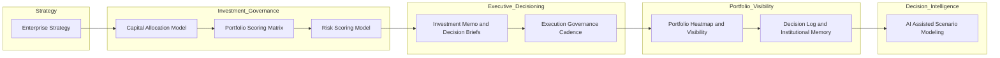
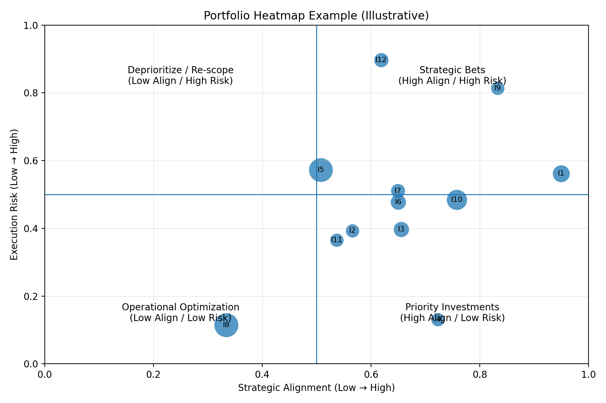

# Product & Technology Portfolio Operating System

This repository documents a structured operating system for governing product and technology portfolios in complex, mission-critical environments.

The system integrates strategy decomposition, capital allocation, portfolio scoring, risk governance, and executive decision support into a coherent framework.

It is designed for environments where delivery predictability, capital discipline, and operational resilience are essential.

## Operating Model Specification

This repository defines a governance operating system for product and technology portfolios.

The system specifies the mechanisms used to translate enterprise strategy into funded initiatives and to govern their execution across the portfolio lifecycle.

The operating model includes:

- strategic investment allocation
- portfolio prioritization and scoring
- delivery risk evaluation
- executive decision artifacts
- portfolio visibility and monitoring
- governance traceability through decision logging
- AI-assisted scenario modeling

The goal is to provide a repeatable framework that improves decision velocity, portfolio transparency, and delivery predictability.

---

## Contents
- Portfolio Operating System Architecture
- Portfolio Heatmap Example
- Operating System Objectives
- Repository Structure
- Governance Frameworks
- Executive Decision Artifacts
- Governance Traceability
- AI-Assisted Decision Support
- Versioning / License

---

## Portfolio Operating System Architecture

The architecture illustrates how enterprise strategy flows through governance mechanisms to produce traceable portfolio decisions.

---

## Portfolio Heatmap Example

Illustrative example showing how initiatives are visualized by strategic alignment and execution risk.  
Bubble size represents relative capital allocation.

---

## Operating System Objectives

The portfolio operating system exists to:

- Translate strategy into funded, executable initiatives
- Ensure disciplined capital allocation across the portfolio
- Surface and manage operational and delivery risk
- Provide leadership with rapid portfolio visibility
- Enable repeatable, auditable decision-making

The goal is clarity at scale.

---

## Operating System Layers

The system is composed of several integrated layers.

- Strategy
- Capital Allocation
- Portfolio Scoring
- Risk Evaluation
- Investment Decisions
- Execution Governance
- Portfolio Visibility
- Decision Traceability

Each layer reinforces the others to maintain portfolio integrity.

---

# Repository Structure

## Governance Frameworks

Located in `/docs`.

These documents define the operating mechanisms for portfolio governance.

- **Operating Model Principles** — foundational governance philosophy  
- **Capital Allocation Model** — structured investment discipline  
- **Portfolio Scoring Matrix** — quantitative initiative evaluation  
- **Risk Scoring Model** — mission-grade risk assessment  
- **Portfolio Heatmap Framework** — portfolio visualization model  
- **Operating Cadence Design** — governance rhythm for decisions  
- **Strategy Decomposition Method** — translating strategy into initiatives  

---

## Executive Decision Artifacts

Located in `/templates`.

These templates provide standardized artifacts used in governance forums.

- **Investment Memo Template** — board-ready investment proposals  
- **Executive Decision Brief** — structured decision summaries  
- **Quarterly Business Review Template** — portfolio performance reporting  
- **Initiative One-Pager** — concise initiative overview

## Example Artifact

A sample investment memo demonstrating how the governance templates in this repository are used in practice.

See:

`examples/sample-investment-memo.md`

---

## Governance Traceability

- **Decision Log** — documented record of portfolio decisions

This ensures institutional memory and auditability.

---

# AI-Assisted Decision Support

AI tools can assist portfolio leadership in:

- Scenario modeling
- Capital allocation tradeoff analysis
- Risk stress testing
- Executive narrative preparation

AI supports decision clarity but does not replace governance authority.

---

# Intended Audience

This operating system is designed for leaders responsible for complex product and technology portfolios, including:

- VP / Head of Product Operations  
- Chief of Staff to CPO or CTO  
- Strategy & Execution leaders  
- Portfolio governance leaders  
- Defense and regulated-industry operators  

---

# Versioning

The repository evolves incrementally as operating mechanisms are refined.

Current release:

**v1.0 — Portfolio Operating System**

---

# Design Principles

1. Governance should accelerate decisions, not slow them.
2. Capital allocation is the highest-leverage portfolio decision.
3. Risk must be visible before it can be managed.
4. Portfolio complexity should resolve into clear signals.
5. Institutional memory strengthens long-term execution.

---

# License

MIT License
