# Product & Technology Portfolio Operating System

---

## 10-Second Overview

**What this repository is:**  
A governance operating system for managing product and technology portfolios.

**What problem it solves:**  
Technology organizations frequently struggle with fragmented investment decisions, limited portfolio visibility, and misalignment between strategy and execution.

This operating system translates **enterprise strategy into prioritized initiatives** and governs their execution through structured investment frameworks, delivery risk evaluation, and executive decision artifacts.

---

## Operating Model Specification

This repository defines a **portfolio governance operating system** used to manage complex product and technology portfolios.

The system provides mechanisms to:

- translate enterprise strategy into funded initiatives  
- prioritize investments across competing initiatives  
- evaluate delivery risk across the portfolio  
- provide structured decision artifacts for executive governance  
- maintain portfolio visibility and institutional memory  

The goal is to improve:

- decision velocity  
- capital allocation discipline  
- portfolio transparency  
- delivery predictability  

---

## Operating Cadence

The portfolio operating system runs on a structured governance cadence.

### Quarterly Portfolio Review

Executive leadership evaluates portfolio health, strategic alignment, and capital allocation.

Activities include:

- reviewing portfolio heatmap and investment priorities  
- evaluating delivery risk across initiatives  
- approving new investments  
- reallocating resources across the portfolio  

### Monthly Execution Review

Product and engineering leadership review delivery progress and operational risk.

Activities include:

- reviewing initiative milestones  
- evaluating delivery risks and dependencies  
- escalating issues requiring executive decisions  

### Decision Governance

Significant portfolio decisions are documented using **investment memos and decision briefs** and recorded in the **decision log** to preserve institutional memory.

---

## Portfolio Operating System Architecture

```mermaid
flowchart LR

subgraph Strategy
  A[Enterprise<br>Strategy]
end

subgraph Investment_Governance
  B[Capital Allocation<br>Model]
  C[Portfolio Scoring<br>Matrix]
  D[Risk Scoring<br>Model]
end

subgraph Executive_Decisioning
  E[Investment Memo<br>Decision Briefs]
  F[Execution Governance<br>Cadence]
end

subgraph Portfolio_Visibility
  G[Portfolio Heatmap<br>Visibility]
  H[Decision Log<br>Institutional Memory]
end

subgraph Decision_Intelligence
  I[AI Assisted<br>Scenario Modeling]
end

A -- strategic priorities --> B
B -- investment evaluation --> C
C -- prioritized initiatives --> D
D -- delivery risk analysis --> E
E -- executive decisions --> F
F -- portfolio updates --> G
G -- operational visibility --> H
H -- decision history --> I
```

The architecture illustrates how enterprise strategy flows through governance mechanisms to produce **traceable portfolio decisions**.

---

## Portfolio Heatmap Example

Illustrative example showing how portfolio initiatives can be visualized by **strategic alignment and delivery risk**.

Bubble size represents relative capital allocation.

---

## Operating System Components

The portfolio operating system is composed of several integrated mechanisms.

| Component | Purpose |
|---|---|
| Strategy Decomposition | Translate enterprise strategy into actionable initiatives |
| Capital Allocation | Prioritize investments across the portfolio |
| Portfolio Scoring | Evaluate initiatives against strategic and operational criteria |
| Risk Evaluation | Identify and quantify delivery risk |
| Investment Decisions | Enable structured executive decision-making |
| Execution Governance | Maintain alignment between strategy and delivery |
| Portfolio Visibility | Provide leadership with portfolio transparency |
| Decision Traceability | Preserve institutional memory and governance history |

---

## Governance Frameworks

The operating system includes several governance mechanisms that support portfolio management.

These frameworks include:

- capital allocation model  
- portfolio scoring matrix  
- risk scoring framework  
- investment memo template  
- executive decision brief  
- decision log  

These mechanisms ensure **consistent evaluation of initiatives and disciplined portfolio governance**.

---

## Executive Scenario Walkthrough

The following scenario illustrates how the operating system supports leadership decision-making.

### Scenario

An organization manages a portfolio of **25 product initiatives across multiple engineering teams**.

Leadership must determine:

- which initiatives require additional investment  
- which initiatives present emerging delivery risk  
- whether resources should be reallocated  

### Step 1 — Portfolio Visibility

The portfolio heatmap provides a visual overview of initiative priority and delivery risk.

### Step 2 — Initiative Evaluation

Each initiative is evaluated using the portfolio scoring matrix and risk scoring model.

### Step 3 — Executive Decision

Leadership reviews **investment memos and decision briefs** to determine appropriate action.

Possible outcomes include:

- increasing investment in strategic initiatives  
- mitigating delivery risk through resource adjustments  
- pausing lower-priority initiatives  

### Step 4 — Governance Traceability

All decisions are recorded in the **decision log**, preserving institutional memory and governance transparency.

---

## Repository Structure

The repository contains the core artifacts used by the portfolio operating system.

| Directory | Purpose |
|---|---|
| docs | Operating model frameworks and governance mechanisms |
| templates | Executive decision artifacts used in governance forums |
| examples | Example artifacts demonstrating the operating model |
| diagrams | Visual architecture and portfolio visualization assets |

---

## Architecture Decisions

Significant governance design decisions are documented using Architecture Decision Records (ADRs).

These records preserve the rationale behind operating model mechanisms and provide transparency for future evolution of the system.

Example:

`architecture-decisions/ADR-001-portfolio-scoring.md`

---

## AI-Assisted Decision Support

AI tools can augment portfolio leadership by supporting:

- scenario modeling for investment decisions  
- capital allocation tradeoff analysis  
- delivery risk stress testing  
- preparation of executive decision artifacts  

AI enhances analytical depth and decision preparation while governance authority remains with leadership.

---

## Intended Audience

This operating model is designed for leaders responsible for managing complex product and technology portfolios, including:

- Chief Product Officers  
- Chief Technology Officers  
- VP Product Management  
- VP Product Operations  
- Strategy & Execution leaders  

---

## Design Principles

The operating system is designed around several guiding principles:

**Strategy-driven investment**  
Portfolio investments must align with enterprise strategic priorities.

**Transparent decision frameworks**  
Initiatives should be evaluated using consistent governance mechanisms.

**Risk-aware portfolio management**  
Delivery risk must be continuously evaluated and surfaced.

**Traceable governance decisions**  
Executive decisions must be documented and preserved.

**Continuous portfolio visibility**  
Leadership must maintain a real-time understanding of portfolio health.

---

## Versioning

The portfolio operating system evolves as governance mechanisms are refined.

Current release:

**v1.0 — Portfolio Operating System**

---

## License

This repository is released under the MIT License.
