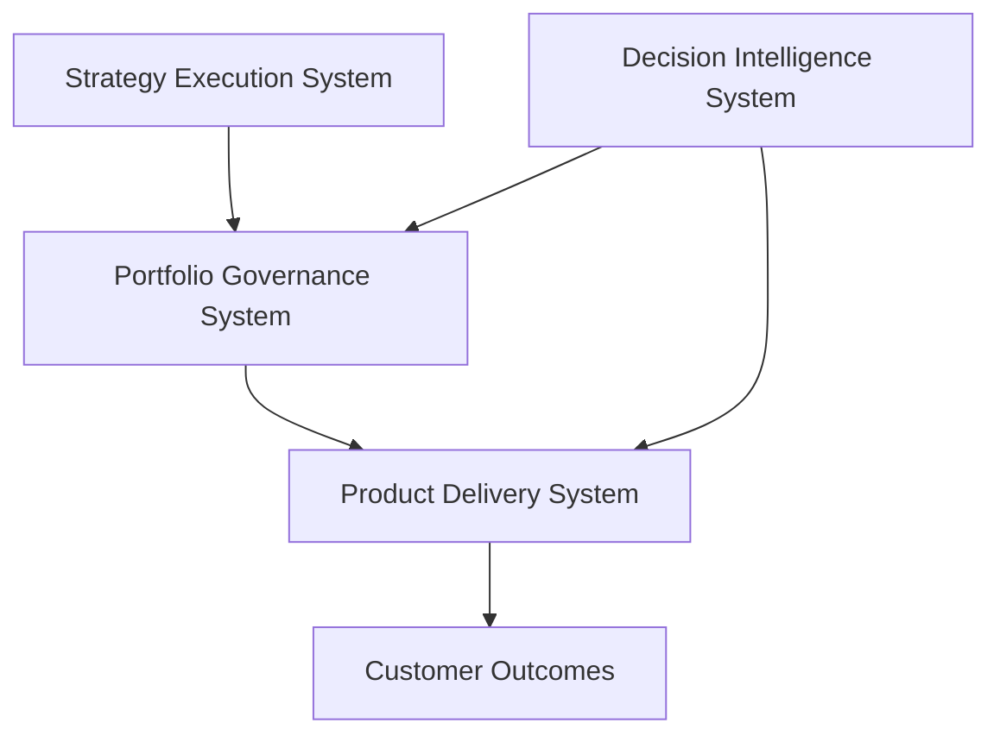

# Portfolio Governance System (Flagship)


Executive operating system for governing product and technology investments through prioritization, capital allocation, delivery risk evaluation, and portfolio visibility.

The Portfolio Governance System provides the structured decision framework used by leadership teams to determine **what initiatives receive investment, how resources are allocated, and how delivery risk is managed across the product portfolio**.

---

## 10-Second Overview

What this repository represents:

A complete governance operating system for managing product and technology investments at scale.

What problem it solves:

Many organizations struggle with fragmented prioritization, inconsistent funding decisions, weak portfolio visibility, and poor institutional memory of past investment decisions.

This system establishes a repeatable executive mechanism to:

- translate strategy into portfolio investments  
- evaluate initiatives using consistent scoring models  
- allocate capital and resources intentionally  
- evaluate delivery risk across the portfolio  
- maintain institutional memory through decision artifacts  

The result is a portfolio governance model that improves **investment alignment, delivery predictability, and executive decision clarity**.

---

## Role in the Product Leadership Systems Architecture



Within the Product Leadership Systems Architecture, the Portfolio Governance System acts as the **decision layer between strategy and execution**.

It translates strategic initiatives into funded investments and provides the governance structure used to manage those investments throughout their lifecycle.

---

## Operating Model

The Portfolio Governance System defines how product organizations govern investments across multiple initiatives and teams.

Key operating responsibilities include:

- translating strategic initiatives into investment candidates  
- prioritizing initiatives using structured scoring frameworks  
- allocating capital and delivery capacity across initiatives  
- evaluating delivery risk across the portfolio  
- maintaining executive decision artifacts and portfolio history  

The operating model ensures that portfolio decisions are **consistent, transparent, and traceable**.

---

## Core Components (Executive Artifacts)

The Portfolio Governance System includes a set of structured decision artifacts used during executive portfolio reviews.

Core components include:

- **Portfolio Scoring Model** — structured evaluation of initiatives based on strategic alignment, value, and feasibility  
- **Capital Allocation Model** — framework for distributing investment across initiatives and teams  
- **Risk Scoring Model** — structured evaluation of delivery execution risk  
- **Investment Memo Template** — standardized executive proposal used to present portfolio investment decisions  
- **Decision Log** — institutional record of portfolio decisions and tradeoffs  
- **Governance Cadence Model** — structured schedule of portfolio review meetings  
- **Portfolio Heatmap Visualization** — visual representation of initiative alignment and delivery risk

Together these artifacts form the core governance toolkit used by leadership to manage portfolio investments.

---

## Governance Cadence

Portfolio governance typically operates on a structured review cadence.

Monthly Portfolio Review  
Leadership evaluates initiative progress, emerging delivery risks, and potential prioritization adjustments.

Quarterly Portfolio Rebalancing  
Leadership evaluates portfolio investment distribution and adjusts capital allocation based on strategic priorities.

Annual Strategic Planning  
Strategic themes and investment guardrails are defined, shaping the pipeline of future initiatives.

This cadence ensures that portfolio decisions remain aligned with strategy while maintaining delivery visibility.

---

## Repository Structure

```
portfolio-governance-system
│
├── architecture
├── frameworks
├── templates
├── governance
├── artifacts
└── visualizations
```

Each directory represents a component of the portfolio governance operating system:

• **architecture** — system diagrams and architectural decision records  
• **frameworks** — portfolio governance frameworks and scoring models  
• **templates** — executive decision artifacts such as investment memos and decision logs  
• **governance** — governance structures, decision authorities, and operating cadence  
• **artifacts** — example outputs produced by the governance system  
• **visualizations** — portfolio dashboards and decision-support visualizations

---

## How to Navigate (Recommended Reading Order)

For readers exploring this repository for the first time, the following path provides the clearest overview of the system.

1. Review the **Portfolio Governance Overview** in the documentation directory.  
2. Examine the **Portfolio Scoring Model** to understand how initiatives are evaluated.  
3. Review the **Capital Allocation Model** to see how resources are distributed across initiatives.  
4. Examine the **Investment Memo Template** used to present portfolio proposals to leadership.  
5. Review the **Decision Log** structure used to maintain institutional memory of investment decisions.  
6. Explore the **Portfolio Heatmap Visualization** to see how portfolio investments can be analyzed visually.

This sequence mirrors how leadership typically interacts with the governance system during portfolio reviews.

---

## Related Systems

The Portfolio Governance System operates as part of the broader **Product Leadership Systems Architecture**.

| System | Purpose | Repository |
|------|------|------|
| Strategy Execution System | Translates enterprise strategy into initiatives and portfolio-ready investments | https://github.com/ChuckFerrando/strategy-execution-system |
| Product Delivery System | Operating model for executing funded initiatives with predictable delivery outcomes | https://github.com/ChuckFerrando/product-delivery-system |
| Decision Intelligence System | AI-assisted analysis supporting portfolio governance and delivery decisions | https://github.com/ChuckFerrando/decision-intelligence-system |
| Architecture Portal | Documentation index for the Product Leadership Systems Architecture | https://github.com/ChuckFerrando/product-leadership-systems |

Together these systems form the **Product Leadership Systems Architecture**, connecting strategy, governance, delivery, and decision intelligence.

---

## License

MIT License

Copyright (c) 2026 Chuck Ferrando

Permission is hereby granted, free of charge, to any person obtaining a copy
of this documentation and associated files to use, copy, modify, merge,
publish, distribute, sublicense, and/or sell copies, subject to the
following conditions:

The above copyright notice and this permission notice shall be included
in all copies or substantial portions of the documentation.

THE DOCUMENTATION IS PROVIDED "AS IS", WITHOUT WARRANTY OF ANY KIND.

## License

This repository is released under the MIT License.
